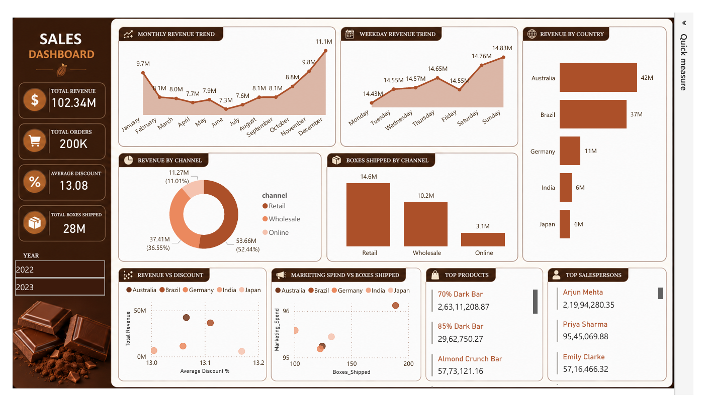

# 🍫 Chocolate Sales Analytics Dashboard

## 📌 Overview
This project presents an interactive **Chocolate Sales Dashboard** built using **Power BI** with data preprocessing done in **Python (Pandas)**.

It provides deep insights into:
- Revenue trends
- Sales channels performance
- Country-wise sales distribution
- Product performance
- Marketing effectiveness
- Sales team performance

---

## 🛠️ Tools & Technologies
- Python (Pandas)
- Power BI
- Data Cleaning & Transformation
- Data Visualization
- Excel/CSV dataset

---

## 📁 Files in Repository
- `dashboard.png` → Final Power BI dashboard snapshot
- `chocolate_sales_analysis.ipynb` → Python pandas cleaning script (if included)
- `chocolate_sales_cleaned` → cleaned dataset 
- `README.md` → Project documentation

---

## 📊 Dashboard Overview

### 💰 Key KPIs
- **Total Revenue:** 102.34M  
- **Total Orders:** 200K  
- **Average Discount:** 13.08%  
- **Total Boxes Shipped:** 28M  

---

## 📈 Key Insights

### 📅 Revenue Trends
- Revenue shows strong growth toward the end of the year.
- Peak monthly revenue occurs in **December (11.1M)**.
- Mid-year dip observed around **June–July**, indicating seasonal slowdown.

---

### 📆 Weekday Performance
- Highest revenue generated on **Sunday (14.83M)**.
- Strong performance also on **Saturday and Friday**.
- Weekdays remain relatively stable around 14.4M–14.6M.

---

### 🌍 Country Performance
- **Australia leads** with **42M revenue**
- Followed by **Brazil (37M)**
- Germany, India, and Japan contribute smaller but stable shares (~6M–11M)

---

### 🏪 Sales Channel Analysis
- **Retail dominates revenue (53.66M / 52.44%)**
- Wholesale contributes **37.41M**
- Online is the smallest channel (**11.27M / 11.01%**)

---

### 📦 Shipping Analysis
- Retail channel leads in **boxes shipped (14.6M)**
- Wholesale follows with **10.2M**
- Online contributes only **3.1M**

---

### 💡 Product Insights
- Top product: **70% Dark Bar (highest revenue contributor)**
- Strong performance also from **85% Dark Bar** and **Almond Crunch Bar**

---

### 👨‍💼 Sales Team Performance
- **Arjun Mehta** is the top performer (219.9M+ sales value)
- Followed by **Priya Sharma** and **Emily Clarke**

---

### 📊 Marketing Insights
- Clear correlation between **marketing spend and boxes shipped**
- Higher spend generally leads to higher shipment volume
- Some countries show better efficiency than others (higher output with similar spend)

---

## 📷 Dashboard Preview

---

## 🚀 Business Impact
- Helps identify best-performing regions and channels
- Supports data-driven marketing decisions
- Improves inventory and sales planning
- Highlights top products and sales representatives

---

## 📌 Future Improvements
- Predictive sales forecasting using Machine Learning
- Profit margin analysis
- Customer segmentation
- Real-time dashboard integration

---

## 👨‍💻 Author
Raghu Ram 
Data Analyst | Python | Power BI
